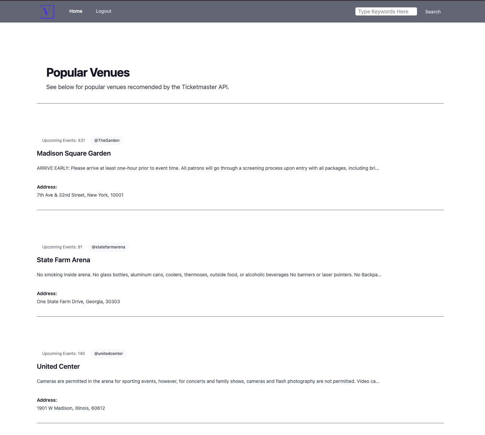

# Venue Viewer 

<p align="center">
    
    
    
    
    
    
    
    
    
    
    
</p>

## Description
The Venue Viewer project is a full-stack web application that was designed and built by the team listed in the contributors below. It is a responsive, full-stack application that utilizes a Node.js backend, a MySql database, Handlebars.js as an HTML template engine and Tailwind CSS for styling. 


## Table of Contents

- [Installation](#installation)
- [Usage](#usage)
- [Example](#example)
- [Contributors](#contributors)
- [Deploy](#deploy)
- [License](#license)
- [Questions](#questions)

## Installation

```
npm install
npm start
```

## Usage
Finding venues near you is just a click away. Easily search for concert venues using keywords and our website will populate venues near you. Want to know more about a venue? Simply click on the venue and you will be provided with details about the venue, user submitted reviews, and a link to purchase tickets directly from the venue’s Ticketmaster page.

## Example




## Contributors

* [Kenny Zhang](https://github.com/KennyZhang12138)
* [Stephan Gemberling](https://github.com/Villzies)
* [Kiara Johnson](https://github.com/Kiararj)
* [Chase Ostien](https://github.com/ChaseOstien)

## Deploy

Website: https://venue-viewer-team1-69164e361419.herokuapp.com/login

## License

ISC License

https://opensource.org/licenses/ISC

## Questions

For additional questions, contact me at the email provided below.

- GitHub: [Venue-Viewer](https://github.com/ChaseOstien/Venue-Viewer)
- Heroku: [Venue-viewer-team1](https://venue-viewer-team1-69164e361419.herokuapp.com/login)
- Chaseostien@gmail.com
